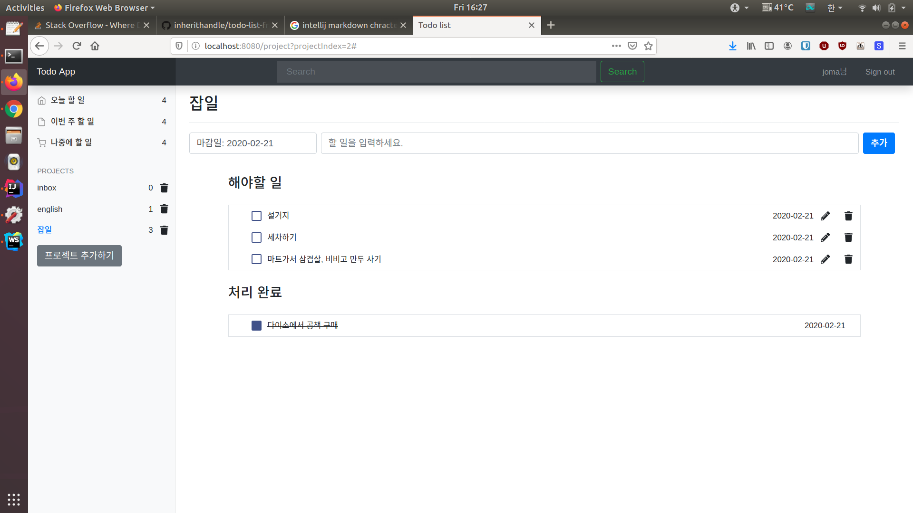

# Todo Application in Vue.js

Vue.js로 작성한 Todolist app입니다. backend server를 설정하여 REST API를 호출하여 유저가 기록한 Todo를 backend DB에 기록합니다. 

### 실행 방법
동작 확인을 위해 백엔드 서버 없이 프론트엔드 단독으로 실행 가능합니다. 영구 저장과 구글 로그인은 동작하지 않습니다.
```
npm install
npm run build:local
npm run start:local
```

### backend와 연동하기 
localhost:8181에 백엔드 서버를 가동하고 `npm run start:dev`로 실행하면, 백엔드와 연동할 수 있습니다.
